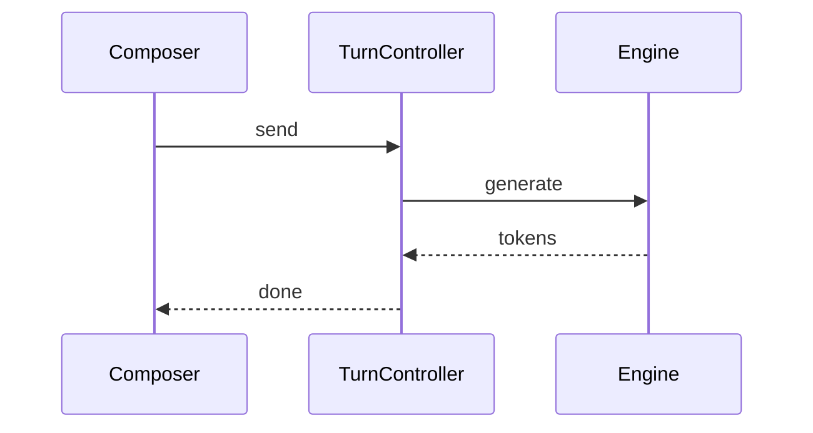

A diagram:

```mermaid
sequenceDiagram
    participant C as Composer
    participant T as TurnController
    participant E as Engine
    C->>T: send
    T->>E: generate
    E-->>T: tokens
    T-->>C: done
```
